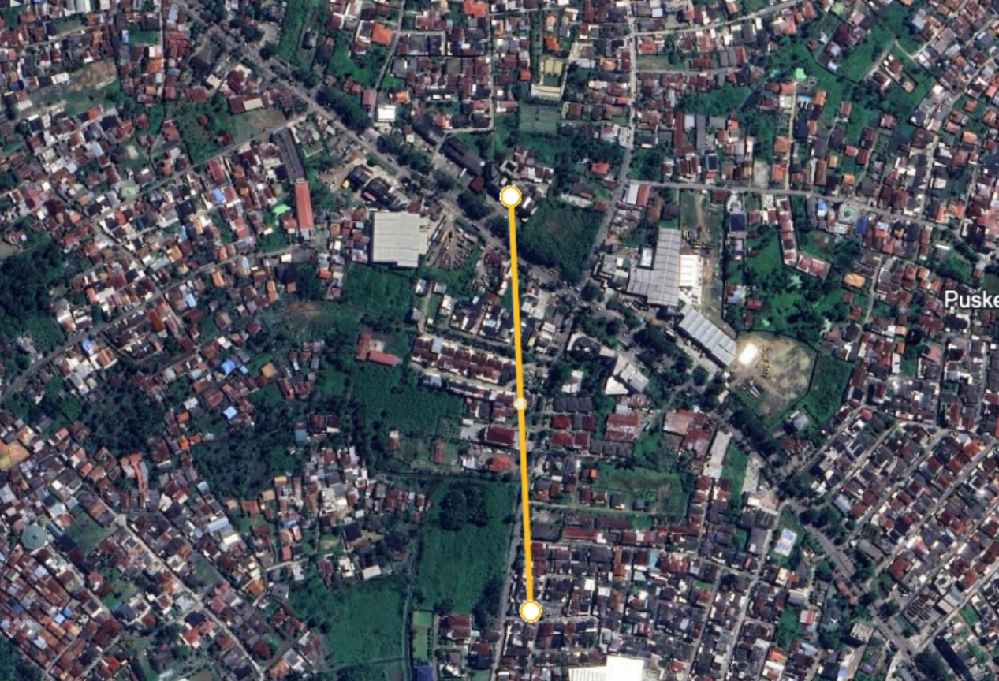
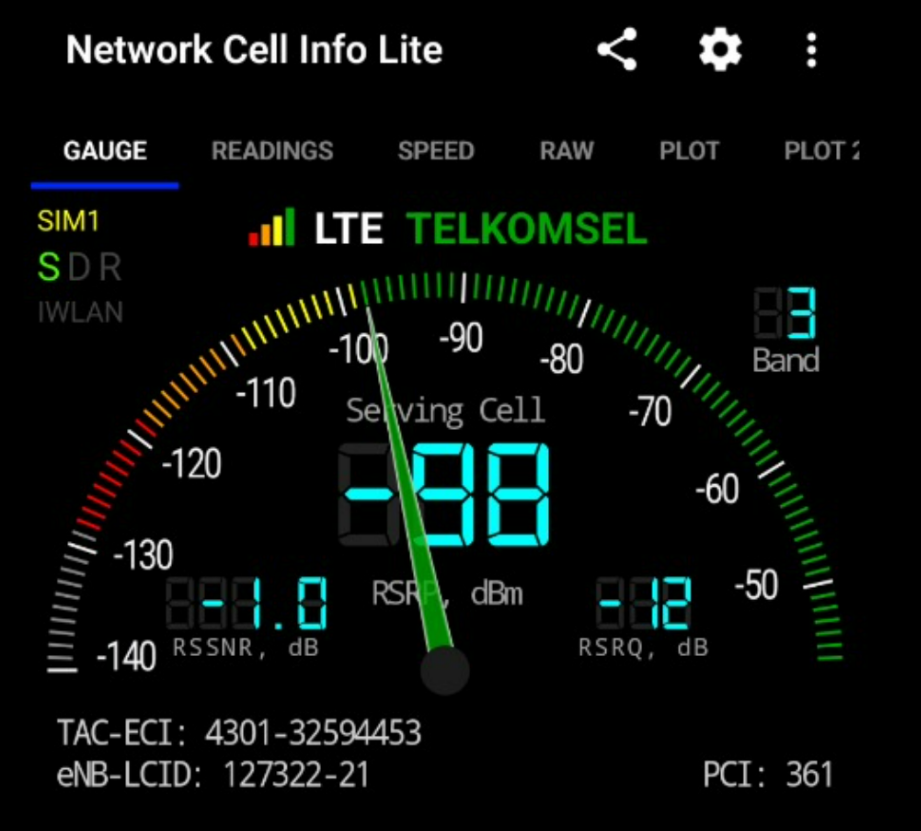
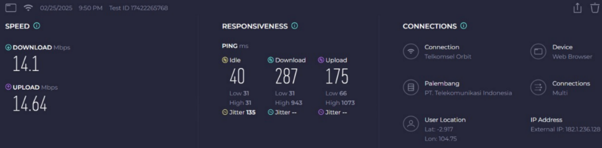

# Tugas 1 - Analisis Sinyal Telkomsel menggunakan Network Cell Info

Nama Kelompok - NIM:  
Muhamad Akbar - 09011382227156  
M. Hamim Al Baghir - 09011382227162  
Ahmad Al-Kahfi Kenedy - 09011382227142   
M. Ferdy Antosa - 09011382227129  
Bayu Trisaputro - 09011382227159
#

<a> Tugas ini menjelaskan analisis sinyal jaringan yang dilakukan menggunakan aplikasi Network Cell Info. 
Analisis ini bertujuan untuk mengevaluasi kekuatan dan kualitas sinyal dari provider tertentu di suatu lokasi. </a>

<a> Berikut ini tabel kebaikan sinyal berdasarkan RSRP dan RSRQ: </a>
 

|    Kategori    |  RSRP (dBm)  |  RSRQ (dB)  |
|:--------------:|:------------:|:-----------:|
|    Excellent   |     > -80    |    > -10    |
|      Good      |  -81 s/d -90 | -11 s/d -15 |
| Good Mid Cell  | -91 s/d -100 | -16 s/d -20 |
| Cell Edge      | < -100       | < -20       |

# Analisis
Percobaan ini dilakukan jarak 390 meter dari Cell Tower terdekat dengan eNB: 127322. Provider yang digunakan adalah Telkomsel.  

Hasil dari percobaan ini adalah sebagai berikut, serta parameter yang merepresentasikan kekuatan dan keterangannya.

|                Parameter                 |                                          Keterangan                                         |    Nilai    |
|:----------------------------------------:|:-------------------------------------------------------------------------------------------:|:-----------:|
|  RSRP (Reference Signal Received Power)  | Menunjukan kekuatan sinyal dalam dbm. Semakin negatif, semakin lemah sinyalnya.             |   -98 dBm   |
| RSRQ (Reference Signal Received Quality) | Kualitas sinyal berdasarkan interferensi dan noise. Nilai lebih mendekati 0 dBm lebih baik. |    -12 dB   |
|          PCI (Physical Cell ID)          | Identifikasi dari sel yang sedang digunakan.                                                |     361     |
| RSSNR ( Reference Signal To Noice Ratio) | Menunjukkan rasio sinyal terhadap noise semakin, tinggi nilainya semakin baik.              |     -1.0 dB |
|         TAC (Tracking Area Code)         | Kode area yang digunakan untuk jaringan seluler.                                            |     4301    |
|         eNB ID (Evolved NodeB ID)        | Identifikasi dari BTS yang melayani perangkat.                                              |    127322   |
|                 Bandwidth                | Lebar pita frekuensi yang digunakan oleh jaringan (contoh: 5 MHz, 10 MHz, 20 MHz).          |    3 MHz    |

Berikut hasil dari Network Cell Info Lite:

Berikut hasil Speedtest:

# Kesimpulan

Berdasarkan hasil pengukuran sinyal provider dari Telkomsel menggunakan aplikasi Network Cell Info Lite, dapat disimpulkan bahwa:
* Kekuatan Sinyal (RSRP) adalah -98 dBm. Ini menunjukkan bahwa sinyal berada di kategori Good Mid Cell yang berarti sinyal masih bisa diterima, tetapi tidak optimal. 
* Kualitas Sinyal (RSRQ) adalah  -12 dB, juga dalam kategori Good. Ini menunjukkan kualitas sinyal yang baik.
* TAC dan eNB ID tidak langsung mempengaruhi kualitas sinyal, tetapi menentukan area cakupan dan koneksi ke BTS tertentu.
* Bandwidth 3 MHz tergolong kecil, membatasi kecepatan dan kapasitas jaringan, sehingga kurang optimal untuk layanan data tinggi.
* Kecepatan download 14.1 Mbps dan upload 14.64 Mbps cukup stabil, namun responsivitas tinggi (287 ms download, 175 ms upload) dapat menyebabkan lag.
